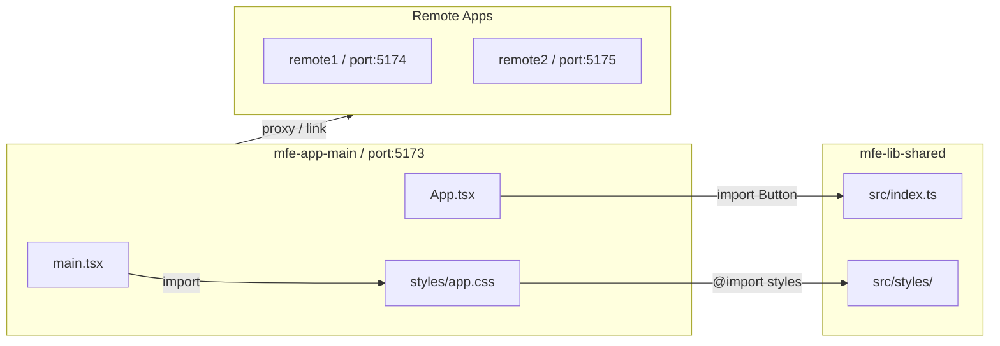

# mfe-app-main Host 앱 세팅 플랜 (Vite + React.js)

## 현재 상태

- `mfe-lib-shared/` — `@nic/mfe-lib-shared` 패키지 (이미 구성 완료, Vite 기반)
- `mfe-docs/` — Docusaurus 문서
- `mfe-app-main/` — **아직 없음 (이번에 생성)**

## 1. Vite React 프로젝트 생성

워크스페이스 루트(`multirepo-mf-boilerplate/`)에서 실행:

```bash
npm create vite@latest mfe-app-main -- --template react-ts
```

생성 후 폴더 이동:

```bash
cd mfe-app-main
```

생성 직후 기본 파일 구조:

```
mfe-app-main/
├── src/
│   ├── App.tsx
│   ├── main.tsx
│   ├── App.css
│   ├── index.css
│   └── assets/
├── index.html
├── package.json
├── vite.config.ts
├── tsconfig.json
└── tsconfig.app.json
```

## 2. `package.json` 설정

`mfe-app-main/package.json` — 패키지명 변경 및 공유 라이브러리 의존성 추가:

```json
{
  "name": "@nic/mfe-app-main",
  "dependencies": {
    "@nic/mfe-lib-shared": "file:../mfe-lib-shared"
  }
}
```

## 3. Tailwind CSS 설치

`mfe-lib-shared`와 동일한 방식(Vite 플러그인)으로 설치:

```bash
npm install -D tailwindcss @tailwindcss/vite
```

## 4. `vite.config.ts` 수정

포트(5173), `@` alias, Tailwind 플러그인, Remote 앱 proxy 설정:

```ts
import { defineConfig } from 'vite'
import react from '@vitejs/plugin-react'
import tailwindcss from '@tailwindcss/vite'
import { resolve } from 'path'

export default defineConfig({
  plugins: [react(), tailwindcss()],
  resolve: {
    alias: {
      '@': resolve(__dirname, 'src'),
    },
  },
  server: {
    port: 5173,
    proxy: {
      // Remote 앱이 추가될 때 여기에 경로 추가
      // '/remote1': { target: 'http://localhost:5174', changeOrigin: true },
    },
  },
})
```

## 5. `tsconfig.json` / `tsconfig.app.json` alias 추가

`mfe-lib-shared`와 동일한 방식으로 두 파일 모두에 `paths` 추가:

```json
// tsconfig.json
{
  "compilerOptions": {
    "baseUrl": ".",
    "paths": {
      "@/*": ["./src/*"],
      "@nic/mfe-lib-shared": ["../mfe-lib-shared/src/index.ts"]
    }
  }
}
```

```json
// tsconfig.app.json (compilerOptions 안에 추가)
{
  "compilerOptions": {
    "baseUrl": ".",
    "paths": {
      "@/*": ["./src/*"],
      "@nic/mfe-lib-shared": ["../mfe-lib-shared/src/index.ts"]
    }
  }
}
```

> `@nic/mfe-lib-shared` alias는 `file:` 로컬 링크 개발 시 타입 추론을 돕기 위한 설정이다. npm/git 배포 후에는 제거한다.

## 6. `.vscode/settings.json` 생성

`mfe-app-main/.vscode/settings.json`:

```json
{
  "editor.formatOnSave": true,
  "editor.codeActionsOnSave": {
    "source.fixAll.eslint": "explicit"
  },
  "editor.tabSize": 2,
  "editor.detectIndentation": false,
  "editor.insertSpaces": false,
  "editor.renderWhitespace": "boundary",
  "editor.quickSuggestions": {
    "comments": "off",
    "strings": "off",
    "other": "off"
  },
  "editor.comments.insertSpace": false,
  "files.associations": {
    "*.json": "jsonc"
  },
  "eslint.validate": [
    "javascript",
    "javascriptreact",
    "typescript",
    "typescriptreact"
  ],
  "eslint.workingDirectories": [{ "mode": "auto" }],
  "editor.defaultFormatter": "esbenp.prettier-vscode",
  "eslint.useFlatConfig": true,
  "css.lint.unknownAtRules": "ignore",
  "scss.lint.unknownAtRules": "ignore",
  "less.lint.unknownAtRules": "ignore"
}
```

## 7. 환경 변수 파일 생성

`mfe-app-main/.env` — Vite 환경 변수는 `VITE_` 접두사 사용:

```env
VITE_REMOTE_REMOTE1_URL=http://localhost:5174
VITE_REMOTE_REMOTE2_URL=http://localhost:5175
```

## 8. `src/styles/app.css` 생성

기존 `src/index.css`, `src/App.css`를 삭제하고 `src/styles/app.css`로 통합:

```css
/* Tailwind 엔진 */
@import 'tailwindcss';
@import 'tw-animate-css';

/* 공유 라이브러리 디자인 토큰 + 스타일 */
@import '@nic/mfe-lib-shared/styles';

/* 공유 라이브러리 컴포넌트의 Tailwind 클래스 스캔 */
@source "../node_modules/@nic/mfe-lib-shared/src/**/*.{ts,tsx}";
```

## 9. `src/main.tsx` 수정

```tsx
import React from 'react'
import ReactDOM from 'react-dom/client'
import './styles/app.css'
import App from './App'

ReactDOM.createRoot(document.getElementById('root')!).render(
  <React.StrictMode>
    <App />
  </React.StrictMode>,
)
```

## 10. `src/App.tsx` 기본 구성

공유 라이브러리 컴포넌트 사용 예시 포함:

```tsx
import { Button } from '@nic/mfe-lib-shared/components'

function App() {
  return (
    <div className="min-h-screen bg-background text-foreground p-8">
      <h1 className="text-2xl font-bold mb-4">MFE App Main (Host)</h1>
      <Button>공유 라이브러리 Button 테스트</Button>
    </div>
  )
}

export default App
```

## 11. 의존성 설치 및 실행

```bash
# mfe-app-main 폴더에서
npm install
npm run dev
```

브라우저에서 `http://localhost:5173` 접속하여 확인.

## 최종 폴더 구조

```
multirepo-mf-boilerplate/
├── mfe-lib-shared/          ← 공유 라이브러리 (기존)
├── mfe-docs/                ← 문서 사이트 (기존)
└── mfe-app-main/            ← Host 앱 (신규, Vite + React)
    ├── .vscode/
    │   └── settings.json
    ├── src/
    │   ├── styles/
    │   │   └── app.css      ← Tailwind + 공유 라이브러리 스타일
    │   ├── App.tsx
    │   └── main.tsx
    ├── index.html
    ├── .env
    ├── vite.config.ts
    ├── tsconfig.json
    ├── tsconfig.app.json
    └── package.json
```

## `mfe-lib-shared`와의 연동 흐름


